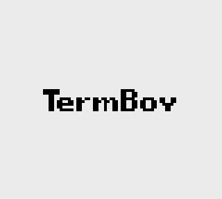
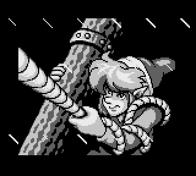
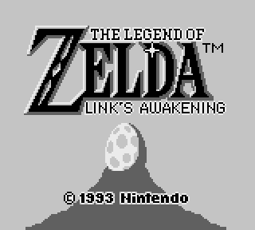
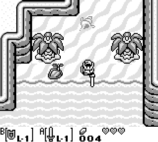

Term Boy
========

Term Boy is a Nintendo Game Boy emulator...for your terminal.

This is an early implementation written in Go. A more complete version (written
in C++) is available [here](https://github.com/dobyrch/termboy).

This project is based on code from an existing Game Boy Color emulator,
[gomeboycolor](https://github.com/djhworld/gomeboycolor).

Be sure to also check out [libtermboy](https://github.com/dobyrch/libtermboy), which distills the techniques used to implement Term Boy into a reusable library (with color support!).

Usage
-----

If you're an Arch Linux user, you can download Term Boy from the
[AUR](https://aur.archlinux.org/packages/termboy).  After compilation, the
binary will be installed as */usr/bin/termboy*.

Users of other distros can download and build Term Boy by running
`go get github.com/dobyrch/termboy-go`.  Start Term Boy by running
`termboy-go <ROM.gb>` in a Linux virtual console.

Use ESDF for the D-pad, G/H for SELECT/START, and J/K for B/A.  Press ESC to quit.

Miscellanea
-----------

Ubuntu users may see the message "Failed to set font height."  Term Boy uses
the `setfont` command to change the font height, which looks for the font
*default8x16.psfu* in */usr/share/consolefonts*.  The font can be downloaded from
the [Kbd project](http://kbd-project.org/download/).  Download any of the
archives and the font will be located in *data/consolefonts*.

A branch for FreeBSD is also available (`git checkout freebsd`).  See PORTING
for more details.

Sound is not yet supported.  If you want sound now, try out my other
[implementation](https://github.com/dobyrch/termboy).

If you would like to see how I generated a custom boot ROM (that shows "Term Boy"
in place of "Nintendo"), see
[bootrom-gen](https://github.com/dobyrch/bootrom-gen).

So... What's the point of this?
-------------------------------

Unlike other video game emulators, Term Boy has *no* dependencies on X11 or
any graphics libraries.  This makes it possible to play high-quality, graphical
games in a command-line environment.  If you're bored of text-based games like
[Adventure](https://en.wikipedia.org/wiki/Colossal_Cave_Adventure), give Term
Boy a shot!
